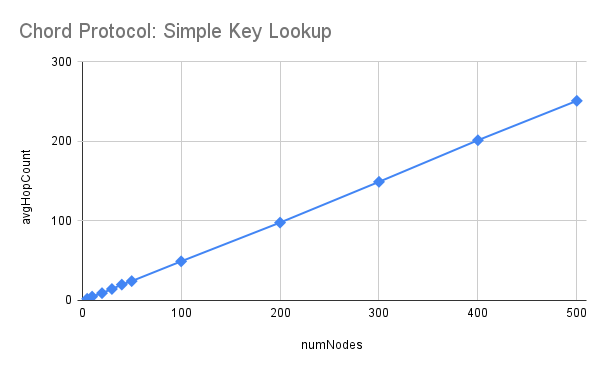

# [COP5615] DOSP Project 3: Implementation of the Chord protocol using the actor model

## Team members
- Nikhil Mukesh Saoji (UFID: 93162869)
- Srikanth Rao Parcha (UFID: 46324560)

## What is working:
- Simple key lookup which follows linear trend and scalable key lookup which follows logarithmic trend, both.
- Initial node is created statically.
- Rest of the nodes are dynamically created and placed into the chord ring based on consistent hashing.
- Successor of node and key, both are found using finger tables and scalable lookup algorithm mentioned in the paper.
- Calculation of average hop count after all nodes serve specified number of requests.

## Largest network we dealt with:
Number of Nodes: 10000 , Number of Requests: 10

## Relation between number of nodes and average hop count:
### Simple key lookup:
We have tested our implementation on nodes ranging in number from 5 to 500. Corresponding observations are as follows:
| Number of nodes | Average hop count |
|----------|-----------------|
| 5        | 2.10     |
| 10       | 4.81     |
| 20       | 9.18     |
| 30       | 14.40    |
| 40       | 19.93    |
| 50       | 24.30    |
| 100      | 49.17    |
| 200      | 97.91    |
| 300      | 149.18   |
| 400      | 201.49   |
| 500      | 251.06   |

From the above chart, it is clear that average hop count is following a linear relationship with number of nodes, as explained in the paper.

### Scalable key lookup
We have tested our implementation on nodes ranging in number from 5 to 10000. Corresponding observations are as follows:
| Number of nodes | Average hop count |
|----------|-----------------|
| 5        | 1.36     |
| 10       | 2.04     |
| 20       | 2.64     |
| 30       | 3.22     |
| 40       | 3.33     |
| 50       | 4.24     |
| 100      | 4.88     |
| 200      | 6.25     |
| 300      | 7.00     |
| 400      | 7.95     |
| 500      | 8.54     |
| 1000     | 9.21     |
| 1500     | 10.76    |
| 2000     | 10.82    |
| 2500     | 11.98    |
| 3000     | 12.65    |
| 3500     | 13.68    |
| 4000     | 13.47    |
| 4500     | 13.65    |
| 5000     | 14.05    |
| 10000    | 15.43    |

From the above chart, it is clear that average hop count is following a logarithmic relationship with number of nodes, as explained in the paper. It is evident that use of finger table reduces the average number of hops drastically.

## Assumptions that we have made about things not clearly mentioned in the paper:
- For the first node, we are intializing the whole finger table with its own value.
- For all other nodes, we are intializing the whole finger table with the successor found in Join() step.
- Schedulers for Stabilize() and FixFinger() are created whenever a node joins. Both the schedulers are running at the same time interval (500 ms in our experiment)is Joined.
- In the FindSuccessor() method, the paper does not talk about the case when both n and successor are equal. This happens when second node tries to join the chord ring. In that case, we are returning the successor(Or n) value itself. Due to this, the second node takes the first node as its successor, and finger tables are then updated accordingly.
- When the key identifier is same as the node identifier, we are sending the node identifier as its successor.

## Steps to run the program
Move to the project directory and run the following command: `dotnet run <numNodes> <numRequests>`